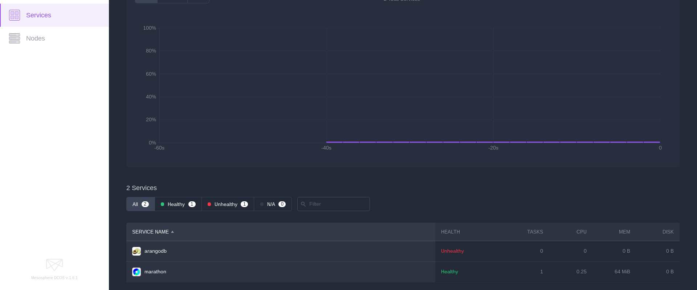
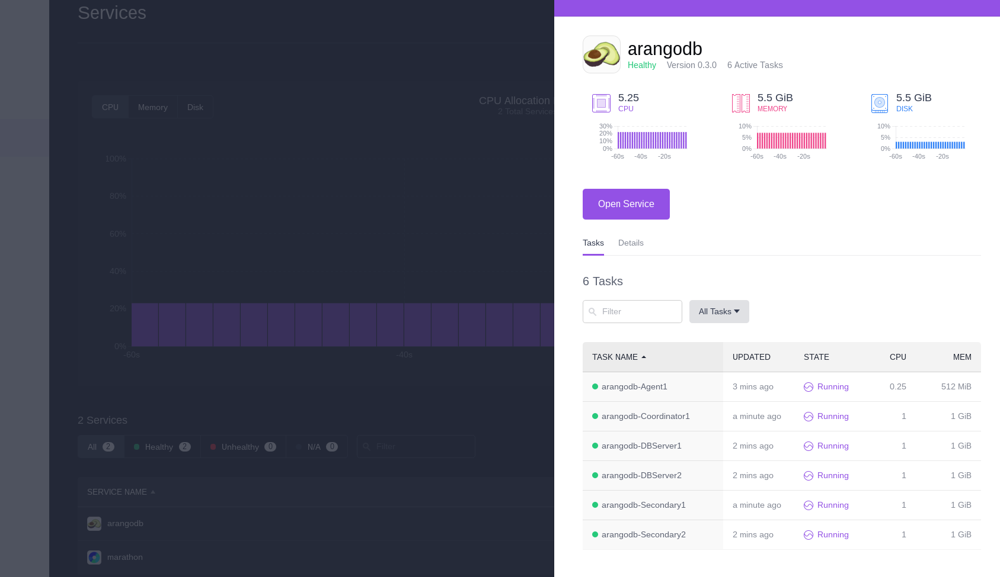
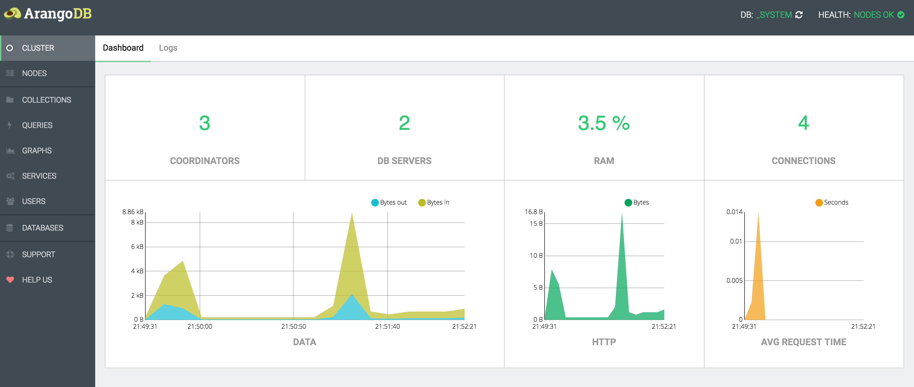

ArangoDB is a distributed, multi-model database featuring JSON
documents, graphs, and key/value pairs. It has a unified query language (AQL)
that allows you to mix all three data models and supports joins and
transactions.

**Time Estimate**:

~5 minutes

**Target Audience**:

Anyone who wants to deploy a distributed multi-model database on DC/OS. Beginner level.

**Scope**:

This tutorial covers the basics in order to get you started with ArangoDB on DC/OS.

## Prerequisites

- A running DC/OS cluster
- [DC/OS CLI](/docs/1.7/usage/cli/install/) installed

## Install ArangoDB on DC/OS

The DC/OS CLI provides a convenient way to deploy applications on your DC/OS cluster.

Deploying ArangoDB via the DC/OS CLI is as easy as:

```bash
dcos package install arangodb3
```

This command installs the `arangodb3` subcommand and starts an instance of the ArangoDB service with its default configuration under its standard name, "arangodb3" via Marathon.

Open the DC/OS web interface in your browser and click the Services tab to watch ArangoDB start up on your Open DC/OS cluster:



Click the ArangoDB task to reveal the subtask that the framework has started:



Click “Open Service” to open the ArangoDB web interface.



Congratulations! You now have ArangoDB running on DC/OS.

## Using ArangoDB within the DC/OS cluster

Now that ArangoDB is running you can fill it with some data and use it as a data store for your applications.

To get started, talk to the "Coordinators" of your ArangoDB cluster. You should not hardcode the "Coordinators" IP addresses and ports in your applications because they can move or change at any time throughout your cluster lifetime (e.g. tasks might fail, up- and downscaling) .

To connect to ArangoDB from the inside deploy the [ArangoDB Mesos HAProxy](https://github.com/arangodb/arangodb-mesos-haproxy).

Clone the repository and start the proxy:

```bash
git clone https://github.com/arangodb/arangodb-mesos-haproxy
cd arangodb-mesos-haproxy
dcos marathon app add marathon.json
```

To make your proxy highly available or scale it, you can simply add a few more instances via the Marathon UI.

## Further reading

### Deinstallation/Shutdown

Use the following commands to shut down and delete your ArangoDB service and the
command line tool:

```bash
dcos arangodb3 uninstall; dcos package uninstall arangodb3
```

The first command uses the `arangodb` subcommand to gracefully shut down and
delete all instances of your ArangoDB service. The framework scheduler
itself will run in silent mode for another 120 seconds. This enables
the second command to remove the `arangodb` subcommand and the entry in
Marathon that would otherwise restart the framework scheduler
automatically.

### Configuration options

There are a number of configuration options, which can be specified in the following
way:

```bash
dcos package install --config=<JSON_FILE> arangodb
```

where `JSON_FILE` is the path to a JSON file. For a list of possible
attribute values and their documentation see

```bash
dcos package describe --config arangodb
```

### Further Information

For further information, visit: https://github.com/arangoDB/arangodb-mesos-framework

The ArangoDB service is also distributed in binary form as a Docker image: arangodb/arangodb-mesos-framework

See the [README.md](https://github.com/ArangoDB/arangodb-mesos-framework)
in the framework repository for details on how the framework scheduler is
configured.

### Support and bug reports

The ArangoDB Mesos framework and the DC/OS subcommand are
supported by ArangoDB GmbH, the company behind ArangoDB. If you get
stuck, need help or have questions, just ask via one of the following
channels:

- [Slack](http://slack.arangodb.com)
- [Google Group](https://groups.google.com/forum/#!forum/arangodb)
- `hackers@arangodb.com`: developer mailing list of ArangoDB
- `max@arangodb.com`: direct email to Max Neunhöffer
- `frank@arangodb.com`: direct email to Frank Celler
- `mop@arangodb.com`: direct email to Andreas Streichardt

Additionally, we track issues, bug reports, and questions via the GitHub
issue trackers at

- [arangodb-dcos](https://github.com/ArangoDB/arangodb3-dcos/issues): The DC/OS subcommand
- [arangodb-mesos](https://github.com/arangodb/arangodb-mesos-framework/issues): The ArangoDB service
- [arangodb-mesos-haproxy](https://github.com/arangodb/arangodb-mesos-haproxy/issues): The ArangoDB Mesos Proxy
