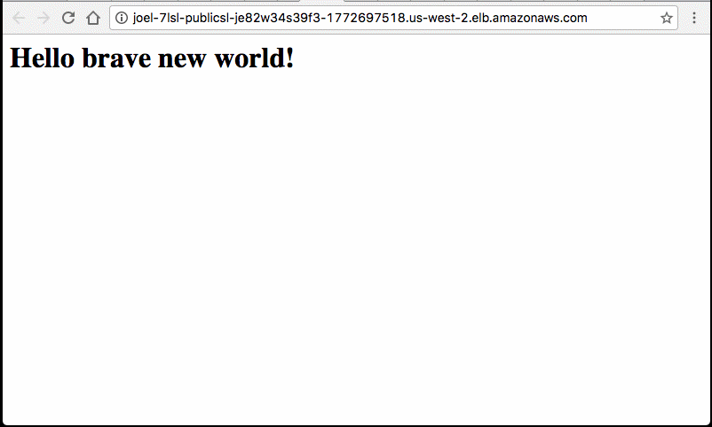

In this tutorial, a custom Docker app is created and added to Marathon.

## Prerequisites

*   [Docker][1] installed on your workstation
*   [Docker Hub][2] account
*   [DC/OS][3] installed
*   [DC/OS CLI][4] installed

# Create a custom Docker container

1.  In the `dcos` directory created by the DC/OS CLI installation script, create a new directory named `simple-docker-tutorial` and navigate to it:

    ```bash
    mkdir simple-docker-tutorial
    cd simple-docker-tutorial
    ```

2.  Create a file named `index.html` by using nano, or another text editor of your choice:

    ```bash
    nano index.html
    ```

3.  Paste the following markup into `index.html` and save:

    ```html
    <html>
        <body>
        <h1> Hello brave new world! </h1>
        </body>
    </html>
    ```

4.  Create and edit a Dockerfile by using nano, or another text editor of your choice:

    ```bash
    nano Dockerfile
    ```

5.  Paste the following commands into it and save:

    ```dockerfile
    FROM nginx:1.9
    COPY index.html /usr/share/nginx/html/index.html
    ```

6.  Build the container, where `<username>` is your Docker Hub username:

    ```bash
    docker build -t <username>/simple-docker .
    ```
    
    The output should resemble:
    
    ```bash
    Sending build context to Docker daemon 3.072 kB
    Step 1 : FROM nginx:1.9
    1.9: Pulling from library/nginx
    51f5c6a04d83: Pull complete 
    a3ed95caeb02: Pull complete 
    640c8f3d0eb2: Pull complete 
    a4335300aa89: Pull complete 
    Digest: sha256:54313b5c376892d55205f13d620bc3dcccc8e70e596d083953f95e94f071f6db
    Status: Downloaded newer image for nginx:1.9
     ---> c8c29d842c09
    Step 2 : COPY index.html /usr/share/nginx/html/index.html
     ---> 61373621782c
    Removing intermediate container 225910aa385d
    Successfully built 61373621782c
    ```

7.  Log in to Docker Hub:

    ```bash
    docker login
    ```

8.  Push your container to Docker Hub, where `<username>` is your Docker Hub username:

    ```bash
    docker push <username>/simple-docker
    ```
    
    The output should resemble:
    
    ```bash
    The push refers to a repository [docker.io/<username>/simple-docker]
    6e2a0db36f4c: Pushed 
    5f70bf18a086: Mounted from library/nginx 
    49027b789c92: Mounted from library/nginx 
    20f8e7504ae5: Mounted from library/nginx 
    4dcab49015d4: Mounted from library/nginx 
    latest: digest: sha256:f733e23e1f5e83a29a223d0a7d30244b30c0d57d17aa0421d962019545d69c17 size: 2185
    ```

# Add your Docker app to Marathon

1.  Create a Marathon app definition with the following contents and save as `nginx.json`. If you’ve created your own Docker container, replace the image name `mesosphere` with your Docker Hub username:

    ```json
    {
        "id": "nginx",
        "container": {
        "type": "DOCKER",
        "docker": {
              "image": "mesosphere/simple-docker",
              "network": "BRIDGE",
              "portMappings": [
                { "hostPort": 80, "containerPort": 80, "protocol": "tcp"}
              ]
            }
        },
        "acceptedResourceRoles": ["slave_public"],
        "instances": 1,
        "cpus": 0.1,
        "mem": 64
    }
    ```

    This file specifies a simple Marathon application called “nginx” that runs one instance of itself on a public node.

3.  Add the NGINX Docker container to Marathon by using the DC/OS command:

    ```bash
    dcos marathon app add nginx.json
    ```

    If this is added successfully, there is no output.

4.  Verify that the app is added:

    ```bash
    dcos marathon app list
    ID      MEM  CPUS  TASKS  HEALTH  DEPLOYMENT  CONTAINER  CMD
    /nginx   64  0.1    0/1    ---      scale       DOCKER   None
    ```
    
1.  If you used the [AWS CloudFormation templates](/docs/1.9/administration/installing/cloud/aws/), you must reconfigure the health check on the public ELB to expose the app to the port specified in your app definition (e.g. port 80). 

1.  Go to your public agent to see the site running. For information about how to find your public agent IP, see the [documentation](/docs/1.9/administration/locate-public-agent/).

    You should see the following message in your browser: 
    
    
    
# Next steps

Learn how to load balance your app on a public node using [Marathon-LB](/docs/1.9/usage/service-discovery/marathon-lb/marathon-lb-basic-tutorial/).
    

 [1]: https://www.docker.com
 [2]: https://hub.docker.com
 [3]: /docs/1.9/administration/installing/
 [4]: /docs/1.9/usage/cli/install/
